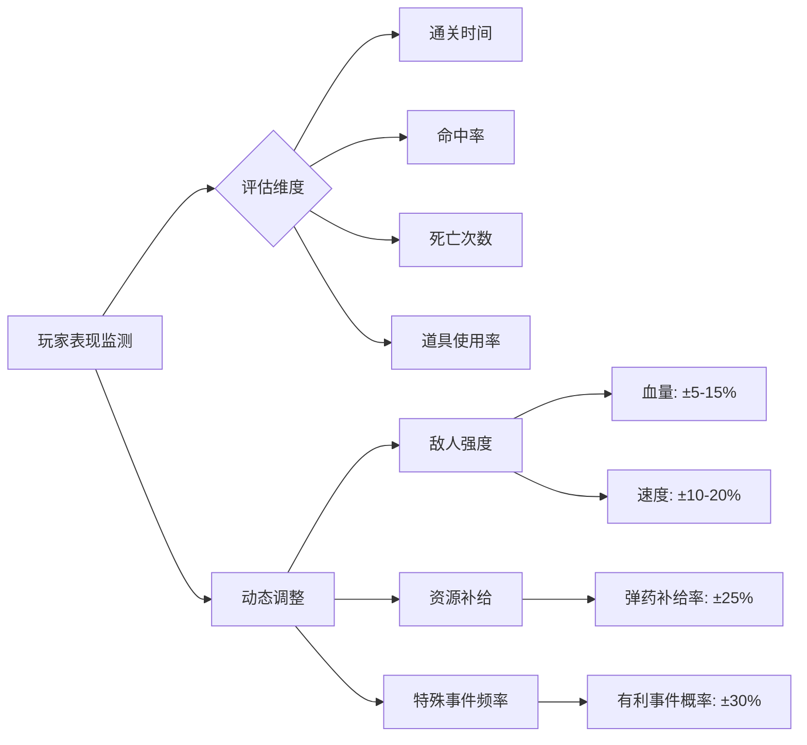

以下是为零基础开发者设计的模块化关卡设计方案，采用经典坦克大战的核心元素并融入现代游戏设计理念：

### 一、基础关卡模板（1-5关）

#### 关卡1：新兵训练营
```markdown
**核心教学机制**：
- 移动训练：L型通道强制转向练习
- 射击训练：固定标靶与移动标靶组合
- 保护机制：基地处于全钢墙保护状态

**敌人配置**：
- 2个固定炮台（不可移动）
- 1个巡逻坦克（矩形路径）
- 特殊规则：敌方子弹速度降低50%

**地形特征**：
┌───────────────┐
│■ □ □ □ □ □ □ ■│
│□ → → → → → → □│ 
│□ ↑       ↓ □│
│□ ↑   ★   ↓ □│
│□ ↑       ↓ □│
│□ ← ← ← ← ← ← □│
│■ □ □ □ □ □ □ ■│
└───────────────┘
（■钢墙 □砖墙 ★基地 →路径指示）
```

#### 关卡3：闪电攻防战
```markdown
**动态机制**：
- 时间压力：180秒限时挑战
- 环境变化：每30秒随机生成/消失砖墙
- 能量系统：移动积累能量，满能量可瞬移

**战略要素**：
1. 优先摧毁雷达站（标记所有敌人位置）
2. 保护移动补给车（随机路线NPC）
3. 利用地形塌陷制造陷阱

**敌人类型**：
- 快速突击车 ×2（无视地形减速）
- 装甲运兵车 ×1（承载3个小坦克）
- 电子干扰车 ×1（禁用玩家雷达）
```

### 二、环境主题关卡（6-10关）

#### 关卡6：熔岩工厂
```markdown
**环境机制**：
- 动态熔岩流：每秒造成区域伤害
- 可激活冷却装置：制造安全通道
- 过热系统：连续射击导致武器过热

**地图特征**：
[传送带系统] → 强制移动特定路线
[熔岩核心] → 周期性爆发造成全屏AOE
[冷却管道] → 可破坏的关键设施

**特殊敌人**：
- 火焰喷射坦克：点燃路径持续伤害
- 熔岩巨人：免疫环境伤害
- 维修无人机：修复被毁设施
```

#### 关卡9：量子迷宫
```markdown
**空间悖论机制**：
- 传送门网络：6组双向传送点
- 空间折叠：射击可穿越边界
- 量子纠缠：摧毁敌人会复制另一个

**解密要素**：
1. 寻找坐标校准器（解除空间扭曲）
2. 收集3个能量矩阵激活出口
3. 利用镜像原理破解激光阵

**视觉表现**：
- 多重残影效果
- 非欧几里得空间连接
- 动态变化的网格坐标系
```

### 三、BOSS战役设计

#### 钢铁要塞·最终防线
```markdown
**三阶段攻防机制**：
▌阶段1：外围突破
- 旋转激光阵：8方向交替扫射
- 自动炮台群：需要特定击破顺序
- 能量护盾：周期性弱点暴露

▌阶段2：核心攻坚 
- 移动要塞：追逐战模式
- 无人机编队：∞刷新直到击破发生器
- 过载系统：倒计时强制撤离

▌阶段3：最终对决
- 变形机甲：三种形态循环切换
- 全屏弹幕：需寻找安全相位区
- 自毁协议：最终10秒极限输出

**环境互动**：
- 可劫持敌方炮台
- 重力控制装置
- 临时能量护盾生成器
```

### 四、动态关卡系统

#### 1. 智能关卡生成器
```javascript
const dynamicLevel = {
  terrain: {
    pattern: ["十字", "蜂窝", "螺旋"][rand(3)],
    density: clamp(0.3 + player.skill * 0.02, 0.3, 0.7)
  },
  
  enemies: {
    types: weightedRandom([
      {type: "基础", weight: 5 - level},
      {type: "快速", weight: 3 + level},
      {type: "装甲", weight: 1 + level*0.5}
    ]),
    aiPreset: ["防御", "突击", "游击"][level % 3]
  },
  
  specialRules: {
    timeAttack: level > 5,
    protectNPC: level % 2 === 0,
    environmentalHazard: level > 3
  }
}
```

#### 2. 自适应难度曲线


### 五、成就与挑战系统

#### 1. 战略成就体系
| 成就类别 | 初级挑战           | 大师挑战              |
|----------|--------------------|-----------------------|
| 精准打击 | 10次连续命中       | 50次无失误穿透射击    |
| 速度之星 | 3分钟内通关        | 1分30秒无伤通关       |
| 战术大师 | 使用3种环境杀敌    | 单次攻击消灭5个敌人   |
| 资源专家 | 保留50%建筑通关    | 0建筑损伤通关         |

#### 2. 隐藏任务触发条件
- **幽灵模式**：不被发现通关（需全程静默移动）
- **子弹时间**：1分钟内反弹20发子弹
- **钢铁洪流**：同时对抗3倍标准敌群
- **量子穿越**：利用传送门实现瞬杀

### 六、教学关卡融合设计

```mermaid
journey
    title 机制解锁进度
    section 基础操作
        移动校准 --> 射击训练 --> 障碍破坏
    section 中级策略
        利用掩体 --> 弱点打击 --> 环境互动
    section 高级战术
        弹道预判 --> 资源控制 --> AI行为诱导
    section 专家技巧
        速攻策略 --> 极限闪避 --> 机制滥用
```

该设计通过以下方式保持开发可行性：
1. **模块化敌人蓝图**：预制不同行为模式的敌人组件
2. **参数化关卡配置**：通过JSON文件定义关卡特征
3. **状态驱动机制**：用有限状态机管理游戏逻辑
4. **可视化调试工具**：实时显示碰撞框、路径计算等
5. **渐进式资源加载**：按需加载素材降低内存压力

是否需要针对特定关卡元素（如熔岩工厂的动态机制）提供详细实现逻辑说明？