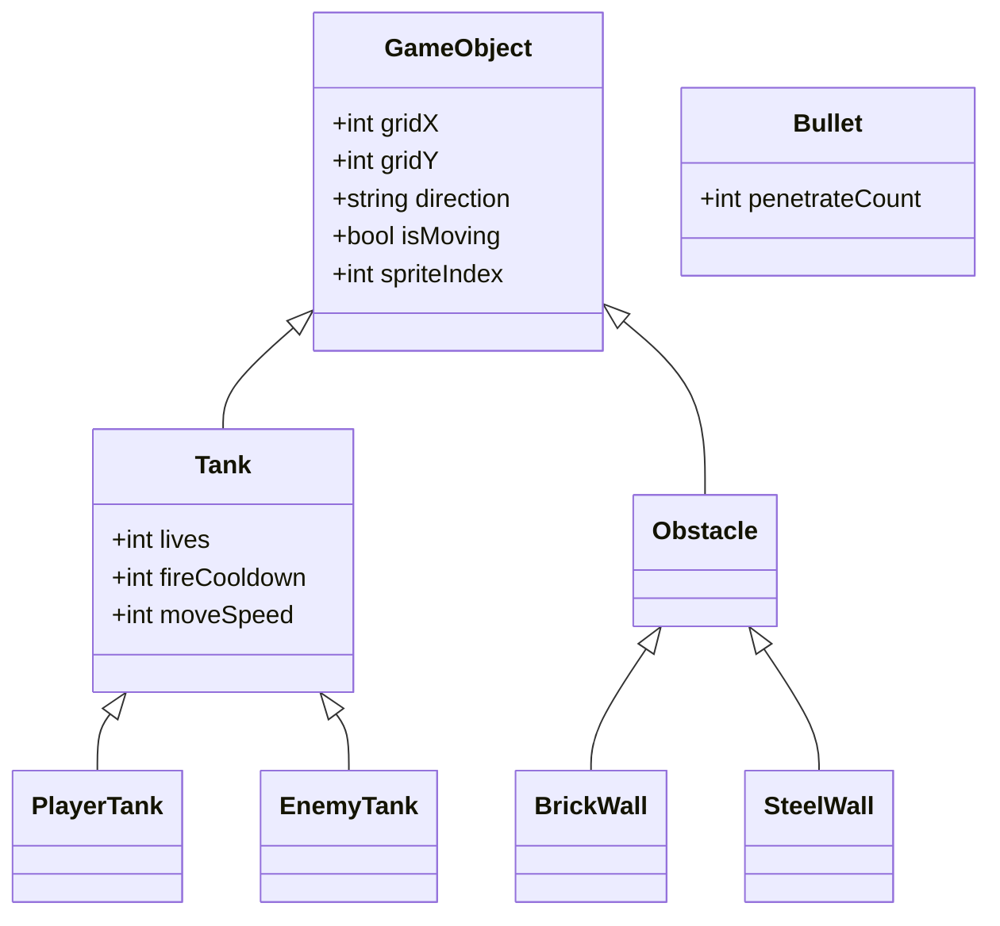
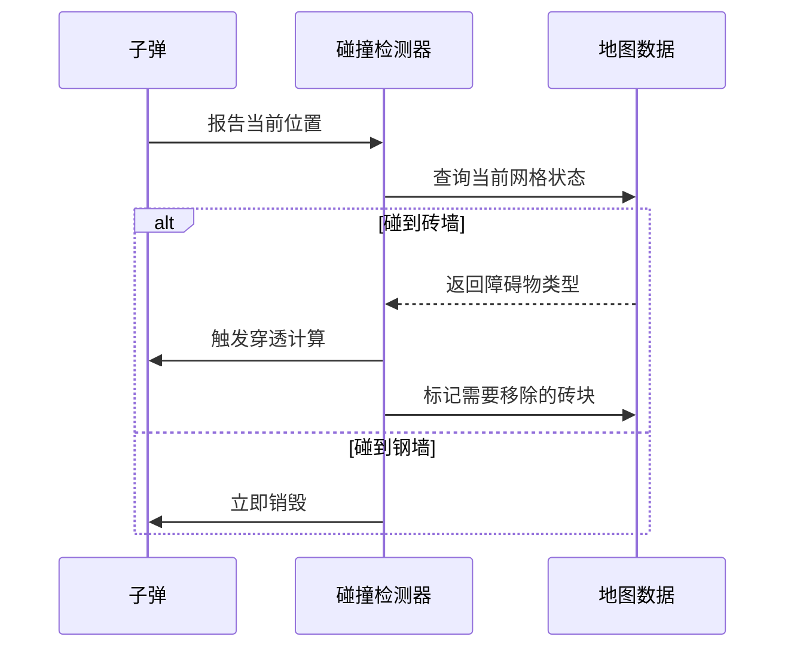
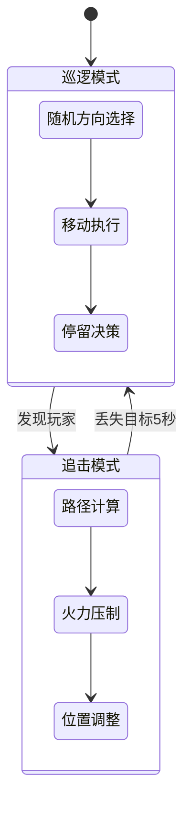

以下是为零基础开发者设计的Canvas版经典坦克大战核心玩法机制方案，聚焦可快速实现的核心机制模块：

### 一、坐标系与实体管理
**1. 离散化网格系统**  
- 26×26像素为基本单元（适配经典素材尺寸）
- 游戏域固定为20×20网格（520×520像素）
- 实体坐标始终对齐网格中心点

**2. 实体状态标记法**  


### 二、移动控制系统
**1. 方向控制机制**  
| 输入指令 | 行为响应                     | 动画表现           |
|----------|------------------------------|--------------------|
| 方向键   | 立即改变方向并移动           | 坦克Sprite旋转切换 |
| 冲突解决 | 遇到障碍物自动停止           | 震动反馈动画       |
| 边缘限制 | 地图边界强制停止             | 闪烁警示边框       |

**2. 坦克转向规则**  
- 立即转向：方向键按下时立即改变朝向
- 移动优先：转向时自动完成当前网格移动
- 轨迹预测：按下Shift键显示可行走路径

### 三、战斗机制设计
**1. 子弹行为矩阵**  
| 参数         | 玩家子弹       | 敌人子弹       |
|--------------|----------------|----------------|
| 速度         | 8像素/帧       | 6像素/帧       |
| 穿透力       | 可穿透1层砖墙  | 不可穿透       |
| 冷却时间     | 0.3秒          | 1.5秒          |
| 最大存在时间 | 3秒            | 2.5秒          |

**2. 碰撞裁决流程**  


### 四、AI行为模板
**1. 敌人行为状态机**  


**2. 简单AI参数**  
```javascript
const basicAI = {
  detectionRange: 5,    // 网格检测半径
  pathUpdateInterval: 2,// 路径重算间隔(秒)
  accuracy: 0.3,        // 射击命中修正系数
  retreatHealth: 20     // 低血量撤退阈值(%)
}
```

### 五、胜利条件系统
**1. 多维度评估体系**  
| 评估维度 | 成功条件                      | 失败条件                |
|----------|-------------------------------|-------------------------|
| 战术目标 | 消灭所有敌方单位              | 基地生命值≤0            |
| 战略目标 | 保护至少50%地图设施           | 玩家生命值≤0            |
| 隐藏目标 | 通关时间≤关卡要求时间×80%     | 连续3次相同地点阵亡     |

**2. 动态难度调节**  
- 敌方数量 = 基础数量 × (当前关卡^0.8)
- 玩家强化 = 初始属性 + 累计击杀×5%
- 环境难度 = 时间压力 + 随机事件强度

### 六、经典元素适配方案
**1. 素材规格标准**  
| 素材类型 | 尺寸     | 方向处理               | 动画帧数 |
|----------|----------|------------------------|----------|
| 坦克     | 26×26px | 四方向独立Sprite       | 2帧抖动  |
| 子弹     | 8×8px   | 方向旋转               | 1帧      |
| 砖墙     | 26×26px | 4种破损状态            | 4帧渐隐  |
| 基地     | 52×52px | 3种警报状态(正常/受损/紧急) | 3帧闪烁 |

**2. 经典操作还原**  
- 双击方向键加速移动
- 长按射击键连发模式
- 特定角度反弹子弹（保留原版物理特性）

### 七、调试辅助机制
**1. 开发者面板**  
```markdown
1. 碰撞可视化开关（F1）
2. AI意图显示（F2）
3. 无敌模式切换（F3）
4. 子弹轨迹预测（长按F4）
5. 状态数据看板（F5）
```

**2. 快速测试功能**  
- 方向键+Enter：跳转到指定关卡
- 数字键1-4：生成指定类型敌人
- Shift+点击：传送到点击位置

该机制设计通过以下方式降低实现难度：
1. **离散坐标系统**避免复杂数学计算
2. **状态标记法**替代复杂对象继承
3. **预制行为模板**简化AI开发
4. **网格化检测**降低碰撞计算复杂度
5. **模块化评估体系**支持渐进式开发

是否需要针对特定机制（如四方向Sprite动画系统）提供详细实现策略？